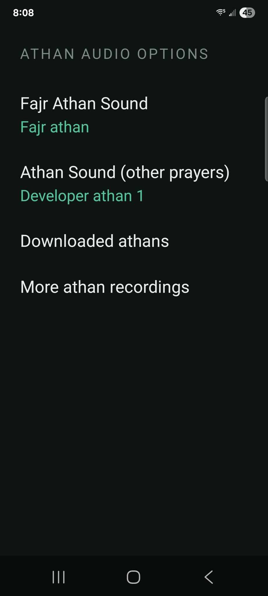
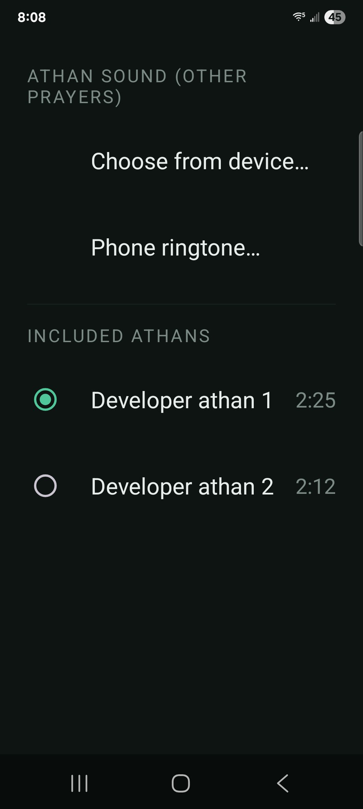
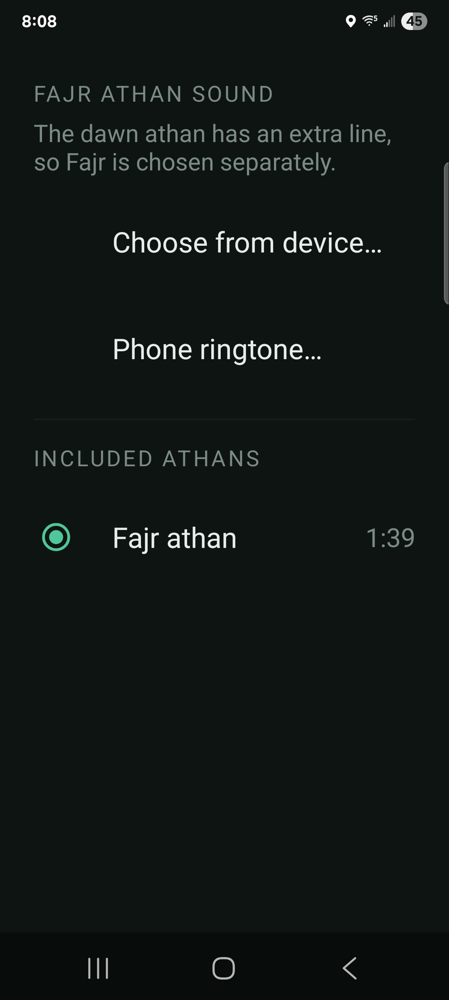

<p align="center">
  
</p>

<h1 align="center">Athan</h1>

<p align="center">
  <b>Offline prayer times, athan and qibla for Android.</b><br>
  No account, no ads, no tracking, no network calls.
</p>

<p align="center">
  <a href="../../releases/latest"></a>
  
  
  
</p>

---

<div dir="rtl" align="right">

## نبذة عن التطبيق

**آذان** تطبيق مجاني خفيف لمواقيت الصلاة، يعمل بالكامل على هاتفك دون حاجة إلى إنترنت أو حساب. لا إعلانات فيه، ولا يجمع أي بيانات، ولا يرسل شيئًا إلى أي خادم.

### ما الذي يقدّمه

- **مواقيت الصلاة دون إنترنت** — تُحسب المواقيت على الجهاز نفسه اعتمادًا على إحداثيات موقعك، مع إمكانية اختيار طريقة الحساب والمذهب، وتعديل يدوي حتى 120 دقيقة زيادةً أو نقصًا إن اختلف توقيت مسجدك المحلي عن الحساب.
- **الأذان في وقته** — لكل صلاة وضع مستقل: **صوت** أو **اهتزاز** أو **صامت**، يُغيَّر بلمسة واحدة على سطر الصلاة. ويُشغَّل الأذان على مسار المنبّه، فيُسمع حتى لو خفّضتَ جرس الهاتف، وتظهر شاشة الأذان فوق شاشة القفل بزرّ إيقاف واحد لا غير.
- **تذكير قبل الصلاة** — تنبيه اختياري قبل دخول الوقت بـ 5 أو 10 أو 15 دقيقة، بنغمة أو باهتزاز.
- **اتجاه القبلة** — بوصلة مصحَّحة إلى الشمال الحقيقي مع مراعاة الانحراف المغناطيسي، وعلامة الكعبة مثبَّتة على القرص.
- **الشروق** يُعرض للاستئناس فقط، ولا يُرفع له أذان.

### عن تسجيلات الأذان

يضمّ التطبيق 29 تسجيلًا. ثلاثة منها بصوتي أنا: تسجيلان لصلوات الظهر والعصر والمغرب والعشاء، وتسجيل خاصّ بالفجر لما فيه من «الصلاة خير من النوم». وبقيّتها ممّا نشره موقع **إسلام ويب**، وقد أذِن الموقع في [الفتوى رقم 379009](https://www.islamweb.net/en/fatwa/379009/) بالانتفاع بمواده لغير أغراض تجاريّة بشرط ذكر المصدر ونسبته إليه — والتطبيق مجاني بلا إعلانات ولا مبيعات، وكلّ تسجيل منسوب إلى قارئه ومصدره في شاشة «المصادر والشكر» داخل الإعدادات.

وما لم يُؤذن فيه لم أُضمّنه: تسجيلات الحرمين من بثّ التلفزيون السعودي ليست ملكًا لإسلام ويب حتى يأذن فيها، فتُركت خارج التطبيق.

ولأنّ الأذواق تختلف، جعلتُ تغيير الصوت سهلًا: اختر أي ملف صوتي من هاتفك، أو افتح شاشة «مزيد من تسجيلات الأذان» التي تحيلك إلى مكتبات معروفة في المتصفّح — والتطبيق نفسه لا يُنزّل شيئًا ولا يستضيفه — ثم يظهر ما نزّلته ضمن «الأذانات المنزَّلة» لتختاره وتُثبّته.

### الخصوصية

لا يجمع التطبيق أي بيانات ولا يرسل شيئًا خارج الهاتف: لا تتبُّع، ولا إعلانات، ولا اتصال بالشبكة أصلًا. تُحفظ إحداثيات موقعك في إعدادات التطبيق الخاصة على جهازك وحده، وتُستخدم لحساب المواقيت واتجاه القبلة فحسب.

### التحميل والتثبيت

نزّل ملف `athan-v1.1.apk` من صفحة [الإصدارات](../../releases). عند فتحه سيطلب منك أندرويد السماح بالتثبيت من مصدر غير معروف، وهي رسالة معتادة لأي تطبيق يُثبَّت خارج متجر Play، ولا علاقة لها بالتطبيق نفسه. يتطلّب أندرويد 8.0 فأحدث، وحجمه نحو 35 ميجابايت.

</div>

---

## In English

It calculates prayer times offline, plays the athan at the right moment (even
with the ringer down), and points to the qibla. Package
`com.ahmedkhalaf.athan`; free, and free of ads.

## Screenshots

<p align="center">
  
  
  
</p>
<p align="center">
  
  
  
</p>
<p align="center">
  
  
  
</p>
<p align="center">
  
  
</p>

<p align="center"><sub>Location details are blacked out in these screenshots. The app keeps your location on the device only.</sub></p>

---

## Download and install

**1. Download the APK**

Go to the [**Releases**](../../releases) page and download `athan-v1.1.apk` from
the latest release. You can do this straight from your phone's browser.

**2. Allow the install**

Android blocks apps from outside the Play Store until you say otherwise. When you
tap the downloaded file you'll see a prompt like *"For your security, your phone
isn't allowed to install unknown apps from this source."*

- Tap **Settings** in that prompt
- Turn on **Allow from this source** (this permission belongs to the browser or
  file manager you downloaded with, not to Athan)
- Press back, then tap **Install**

You only do this once. It's the normal prompt for any app installed outside the
Play Store — nothing specific to this app.

**3. Play Protect may warn you**

Google scans unknown apps and may show *"Unsafe app blocked"* or *"App scan
recommended"*. This is Play Protect telling you it has never seen this app
before, not that it found anything. Tap **More details → Install anyway** (or
**Scan app**) if you want to continue.

**4. First run**

- Set your location (the app asks once and stores the coordinates locally)
- Grant the **notification** permission so the athan can appear over the lock
  screen
- If your phone asks about **alarms & reminders**, allow it — that is what lets
  the athan fire at the exact minute rather than whenever the system feels like it

### Updating later

Download the newer APK and install it over the top. Your settings are kept.
Every release is signed with the same key, so updates install cleanly.

### If you'd rather not install an APK

You can also build it yourself from this source — see [Building](#building-from-source).

---

## What it does

**Prayer times, fully offline.** Computed with the
[adhan](https://github.com/batoulapps/adhan-java) library from your coordinates.
Calculation method and madhab are selectable (default ISNA / Shafi), and there is
a ±120-minute manual adjustment if you follow a local mosque's timetable.

**The athan actually plays.** Each prayer is set to **Sound**, **Vibrate**, or
**Silent** independently — tap the row to change it. Sound plays on the alarm
audio stream, so it is audible with the ringer turned down, and the athan window
appears over the lock screen with a single Stop button.

**Reliable scheduling.** Uses `AlarmManager.setAlarmClock`, the one tier Android's
Doze mode never delays. Alarms are re-armed after each prayer, after a reboot,
and after a timezone change.

**Pre-prayer heads-up.** Optional reminder 5, 10, or 15 minutes before each
prayer, with its own tone or vibration.

**Qibla compass.** True-north corrected (magnetic declination is applied), with a
Kaaba marker on the dial. Falls back to showing the bearing in degrees if your
phone has no magnetometer.

**Sunrise** is displayed for reference, and never fires an athan.

---

## About the athan recordings

**29 recordings ship with the app**, from two sources.

**Three are my own** — *Developer athan 1* and *2* for Dhuhr, Asr, Maghrib and
Isha, and a *Fajr* recording carrying *aṣ-ṣalātu khayrun min an-nawm*.

**The rest were published by IslamWeb** (islamweb.net). IslamWeb permits its
material to be used for non-commercial purposes provided the source is named —
[fatwa no. 379009](https://www.islamweb.net/en/fatwa/379009/). This app is free,
carries no ads and sells nothing, and every recording is credited to its reciter
and source in the app under **Settings → Resources & credits**. That screen is
generated from the shipped audio index, so it cannot list a recording the app
does not have, or miss one it does.

**What is deliberately not included:** the Mecca and Madina recordings. Those are
Saudi state broadcasts — IslamWeb hosts them but does not own them, so its
permission does not extend to them. Attribution is not a licence, and a credit
line does not create a right to redistribute.

Not to your taste? The app makes it easy to use something else:

- **Settings → Athan audio options → Fajr Athan Sound / Athan Sound (other
  prayers) → Choose from device…** — any audio file already on your phone
- **Phone ringtone…** — any ringtone or notification tone
- **Settings → Athan audio options → More athan recordings** — opens IslamWeb's
  library in your **browser**. The app never downloads or hosts audio itself; you
  download what you want, the app tells you when it lands, and it appears under
  **Downloaded athans** ready to assign.

---

## Privacy

**Nothing is collected, and nothing leaves your phone.** There is no analytics
SDK, no crash reporter, no ad network, and the app makes no network requests at
all. Your coordinates are stored in the app's own private settings and used only
for the astronomy calculations.

Permissions and why they exist:

| Permission | Why |
|---|---|
| Location (coarse/fine) | To compute prayer times and the qibla bearing. Optional — you can enter a city instead. |
| Notifications | Required to show the athan and reminder |
| Exact alarms | To fire the athan at the exact minute |
| Full-screen intent | To show the athan window over the lock screen |
| Foreground service (media playback) | Android requires one to play the athan reliably |
| Read audio | Only to list athan files you downloaded yourself. Nothing is uploaded. |
| Vibrate, wake lock, boot completed | Vibration mode, waking the screen, re-arming alarms after a restart |

---

## Building from source

```bash
git clone https://github.com/<your-account>/Athan.git
cd Athan
./gradlew assembleDebug
```

Requires JDK 17+ and the Android SDK (compileSdk 36, build-tools 35.0.1).
The debug build needs no signing setup.

The bundled audio is generated from source recordings by `tools/sync-audio.ps1`,
which re-encodes anything above 100 kbps to 96 kbps mono and writes the index the
app reads at runtime — durations, and each recording's reciter and source, taken
from its own ID3 tags. The credits screen is built from that index, so attribution
is generated rather than typed and cannot drift out of step with what ships. The
processed assets are committed, so you do not need to run it unless you are
adding recordings of your own.

---

## Licence

**Source code:** [MIT](LICENSE).

**Audio** — not covered by the MIT licence:
- The three `Developer_Athan-*` recordings are mine, under CC BY 4.0.
- Every other recording was published by IslamWeb and is included under its
  non-commercial-with-attribution permission ([fatwa no.
  379009](https://www.islamweb.net/en/fatwa/379009/)). They remain the property
  of their reciters and of IslamWeb, are **not** relicensed here, and may not be
  used commercially. If you fork this repo, either honour those terms or delete
  the files.

**Launcher artwork:** © 2026 Ahmed Khalaf, all rights reserved.

## Contact

Ahmed Khalaf — ahmedkhalaf1@yahoo.com · [github.com/nandxorandor](https://github.com/nandxorandor)

Bug reports and suggestions are welcome in [Issues](../../issues).
